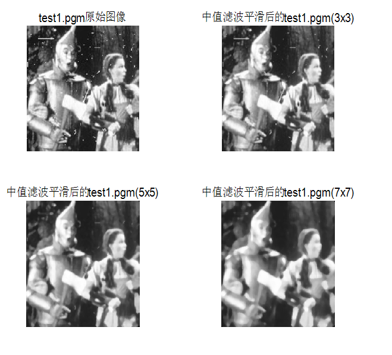
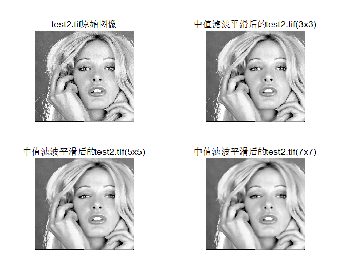
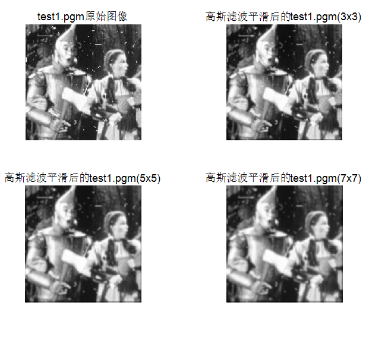
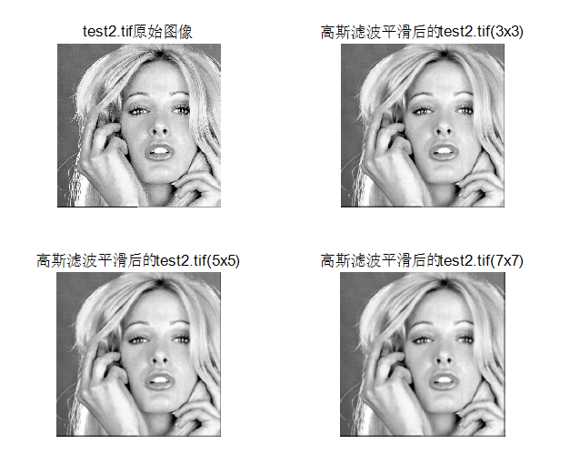
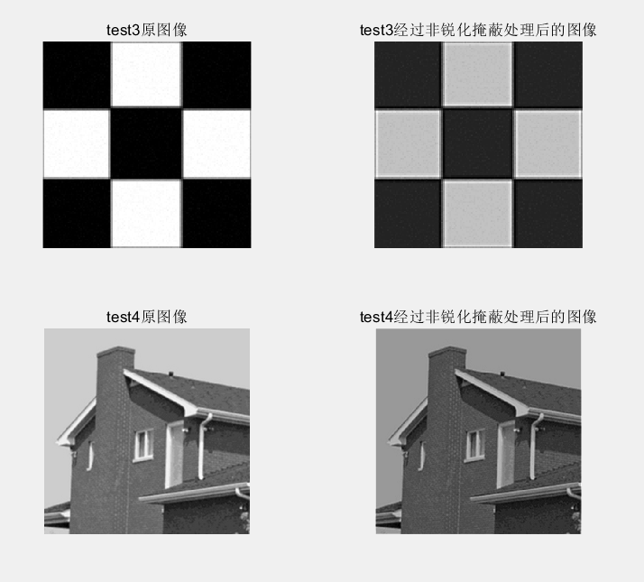
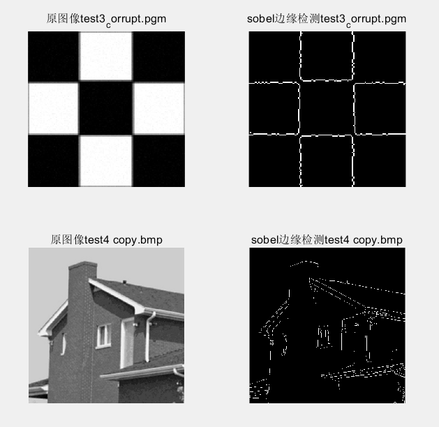
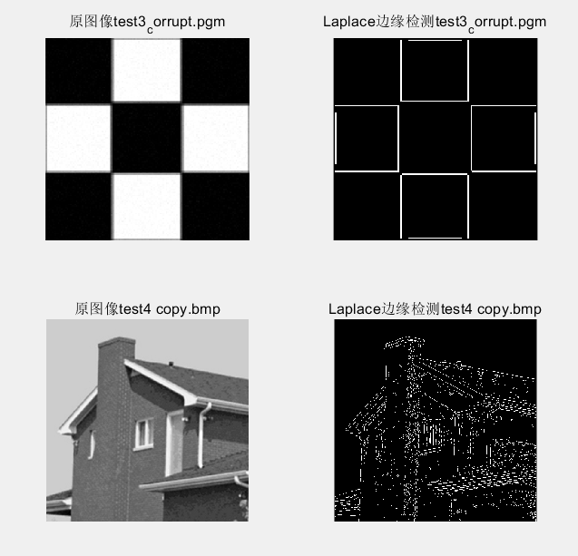
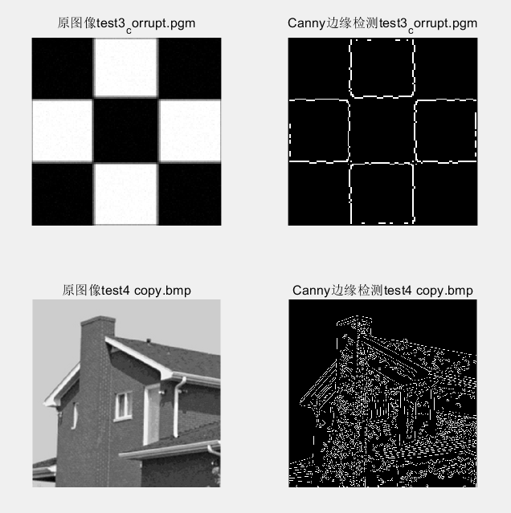

# **数字图像处理第四次作业**

 

 

 

 

姓名：陈运波

班级：自动化64

学号：2160504090

提交日期：2019.03.18

 

 

 

## **摘要**

本次作业在matlab2018平台上完成了对图像的平滑处理和边缘检测任务。通过这次作业我学习了空域滤波器的使用，学习了如何产生高斯滤波器以及几种边缘检测方法。通过对比实验结果可以发现高斯滤波器对于细小的噪声优化效果较好，而中值滤波器对于大噪声也有一定的优化效果。使用Canny算子边缘检测相比其他边缘检测方法较好一些，虽然仍旧存在边缘不连续的问题，但是整体的边缘已经提取了出来。

##  技术讨论和报告

###  一、空域低通滤波器：分别用高斯滤波器和中值滤波器去平滑测试图像test1和2，模板大小分别是3x3 ， 5x5 ，7x7； 利用固定方差 sigma=1.5产生高斯滤波器； 分析各自优缺点；

#### （1）问题分析：

空域滤波是直接对图像的数据做空间变换达到滤波的目的。它是一种邻域运算，其机理就是在待处理的图像中逐点地移动模板，滤波器在该点地响应通过事先定义的滤波器系数与滤波模板扫过区域的相应像素值的关系来计算。高斯滤波是一种根据高斯函数的形状来选择模板权值的线性平滑滤波方法。高斯平滑滤波器对去除服从正态分布的噪声是很有效果的。

为了完成上述任务，调用matlab中的函数medfilt2（），设定它的参数是[3 3]、[5 5]、[7 7]改变它的模板，成功实现用中值滤波器对图像进行平滑处理。高斯滤波器，可以调用matlab中的fspecia（）l函数和imfilter（）函数，也可以实现对图像的平滑处理。

#### （2）处理结果：

#### （3）结果分析：

对比实验结果发现，中值滤波器平滑图像的效果较好。当模板大小为5x5时，中值滤波器平滑后的test1已经基本看不出噪声，高斯滤波器平滑后的test1还存在一些噪声。但是中值滤波器平滑后的图像细节更模糊。

### 二、利用高通滤波器滤波测试图像test3,4：包括unsharp masking, Sobel edge detector, and Laplace edge detection；Canny algorithm.分析各自优缺点；

#### （1）问题分析：

  锐化滤波能减弱或消除图像中的低频率分量，但不影响高频率分量。因为低频分量对应图像中灰度值缓慢变化的区域，因而与图像的整体特性，如整体对比度和平均灰度值等有关。锐化滤波将这些分量滤去可使图像反差增加，边缘明显。在实际应用中，锐化滤波可用于增强被模糊的细节或者低对比度图像的目标边缘。

unsharp masking非锐化掩蔽的处理过程由下列步骤组成：

1. 模糊原图像

2. 从原图像中减去模糊图像（产生的插值图像称为模板）

3. 将模板加到原图像上

  Sobel edge detector, and Laplace edge detection；Canny algorithm可以调用matlab中的函数edge()实现。

#### （2）处理结果：

#### （3）结果分析：

1. 非锐化掩蔽处理后的图像边缘更加清晰，达到了预期的效果，但是可以看到引入了一些噪声，且图像变暗。

2. 索贝尔边缘检测速度较快，应用广泛。但是它没有基于图像灰度进行处理，导致提取出来的图像轮廓并不是很理想。观察实验结果发现，test4的图像边缘并没有被完全分离出来。

3. 拉普拉斯边缘检测对于test3来说效果较为理想。但对于test4的边缘检测效果不是很理想，灰度变化不明显的区域没有分离出来。

4. Canny算子边缘检测效果较好，对于test4这样边界灰度变化不明显的图片也可以很好地将图像的边缘提取出来。

## 附录

### **参考文献**：

[1] 冈萨雷斯.数字图像处理（第三版）北京：电子工业出版社，2011

[2] 周品.MATLAB数字图像处理 北京：清华大学出版社，2012

[3] 杨杰.数字图像处理及MATLAB实现 北京：电子工业出版社，2010

### 源代码：

见txt文档

 